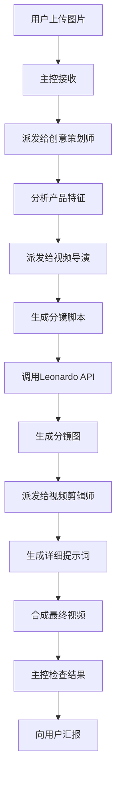

# AI TikTok Promo Video Generator - 项目规则

## 1. 项目基础信息

### 项目元数据

| 项目 | 内容 |
|------|------|
| **名称** | AI TikTok Promo Video Generator |
| **代号** | tiktok-promo-gen |
| **版本** | v1.0.0 |
| **路径** | `/root/.openclaw/workspace/projects/ai-tiktok-promo-generator/` |
| **开始时间** | 2026-03-04 |

### 项目目标

**一句话描述**：
> 用户上传产品图片 → AI自动生成专业TikTok宣传视频

**核心价值**：
- 零设计经验要求
- 全自动化流程
- 专业级视频质量
- 分钟级完成时间

---

## 2. 多智能体协作分工

### 角色定义

| 角色 | ID | 职责 | 技能要求 |
|------|----|----|----------|
| 🎯 **主控/计划者** | `planner` | 协调整体流程、分配任务、检查结果 | 协调能力、质量把控 |
| 💡 **创意策划师** | `creative-planner` | 分析产品、提炼卖点、设计创意方向 | 营销思维、创意能力 |
| 🎬 **视频导演** | `video-director` | 设计分镜、编写脚本、规划镜头 | 视频制作、分镜设计 |
| 🎥 **视频剪辑师** | `video-editor` | 生成提示词、规划特效、文字设计 | 后期制作、特效设计 |
| 🔧 **后端工程师** | `backend-engineer` | 实现核心功能、API集成 | Python、API开发 |
| 🎨 **前端工程师** | `frontend-engineer` | 实现Web界面 | Gradio、UI设计 |
| 🧪 **测试员** | `tester` | 测试功能、验证质量 | 测试方法、质量保证 |
| 📚 **图书馆馆长** | `librarian` | 维护文档、更新日志 | 文档编写、知识管理 |

### 协作规则

#### 主控/计划者（我）
```yaml
职责:
  - 接收用户需求
  - 构建项目团队
  - 分配任务给子agent
  - 检查子agent结果
  - 向用户汇报进展

禁止:
  - 直接修改代码
  - 跳过检查环节
  - 不经验证就汇报
```

#### 创意策划师
```yaml
职责:
  - 分析产品图片
  - 提炼核心卖点
  - 识别目标受众
  - 确定创意方向
  - 输出：产品分析报告

输出格式:
  {
    "product_name": "产品名称",
    "key_features": ["卖点1", "卖点2"],
    "target_audience": "目标用户",
    "creative_direction": "创意方向",
    "keywords": ["关键词1", "关键词2"]
  }
```

#### 视频导演
```yaml
职责:
  - 设计9宫格分镜
  - 编写场景描述
  - 规划镜头顺序
  - 输出：分镜脚本

输出格式:
  {
    "scenes": [
      {
        "id": 1,
        "title": "开场吸引",
        "description": "场景描述",
        "duration": 2,
        "camera": "推镜头",
        "text": "显示文字"
      }
    ]
  }
```

#### 视频剪辑师
```yaml
职责:
  - 为每个场景生成详细提示词
  - 规划镜头运动
  - 设计文字特效
  - 输出：详细提示词

输出格式:
  {
    "prompts": [
      {
        "scene_id": 1,
        "leonardo_prompt": "Leonardo AI提示词",
        "camera_movement": "slow zoom in",
        "text_overlay": {
          "content": "文字内容",
          "position": "center",
          "animation": "fadeIn"
        },
        "effects": ["blur", "glow"]
      }
    ]
  }
```

---

## 3. 技术规范

### 3.1 视频输出规范

| 参数 | 值 | 说明 |
|------|-----|------|
| **分辨率** | 1080x1920 | TikTok竖屏9:16 |
| **帧率** | 30fps | 标准帧率 |
| **编码** | H.264 (libx264) | 兼容性最好 |
| **比特率** | 5-8 Mbps | 高清质量 |
| **音频** | AAC 128kbps | 标准音质 |
| **格式** | MP4 | 通用格式 |
| **时长** | 15-60秒 | TikTok推荐时长 |

### 3.2 分镜图规范

| 参数 | 值 |
|------|-----|
| **数量** | 9张（3x3网格） |
| **分辨率** | 1024x1024（Leonardo AI） |
| **格式** | PNG（透明背景） |
| **风格** | 与产品图一致 |

### 3.3 API使用规范

#### Leonardo AI

```yaml
端点: https://cloud.leonardo.ai/api/rest/v1/generations
认证: Bearer {API_KEY}
限制:
  - 免费额度: 150张/月
  - 生成速度: ~30秒/张
  - 并发限制: 5个任务

使用策略:
  - 批量生成时串行执行
  - 错误重试: 最多3次
  - 超时: 60秒
```

#### Claude Sonnet (子agent)

```yaml
模型: anthropic/claude-sonnet-4-6
温度: 0.7（创意任务）
最大tokens: 4096
超时: 根据任务复杂度设置
```

---

## 4. 工作流程规范

### 4.1 标准流程



### 4.2 阶段时间估算

| 阶段 | 任务 | 时间 |
|------|------|------|
| 1 | 创意分析 | 2分钟 |
| 2 | 分镜脚本 | 3分钟 |
| 3 | 分镜图生成 | 5分钟（9张图） |
| 4 | 提示词生成 | 2分钟 |
| 5 | 视频合成 | 1分钟 |
| **总计** | | **~13分钟** |

### 4.3 错误处理

| 错误类型 | 处理方式 |
|----------|----------|
| API调用失败 | 重试3次 → 失败则汇报用户 |
| 子agent超时 | 重新派发 → 最多2次 |
| 视频生成失败 | 回退到简化版本 |
| 用户不满意 | 收集反馈 → 调整参数 → 重新生成 |

---

## 5. 代码规范

### 5.1 Python代码规范

```python
# ✅ 正确示例
def generate_storyboard(
    product_image: str,
    creative_brief: dict,
    num_scenes: int = 9
) -> list[dict]:
    """
    生成分镜脚本
    
    Args:
        product_image: 产品图片路径
        creative_brief: 创意简报
        num_scenes: 场景数量
    
    Returns:
        分镜脚本列表
    
    Raises:
        ValueError: 参数无效时
        APIError: API调用失败时
    """
    try:
        # 实现...
        pass
    except Exception as e:
        logger.error(f"生成分镜失败: {e}")
        raise
```

### 5.2 错误处理规范

```python
# ✅ 正确
try:
    result = api_call()
except APIError as e:
    logger.error(f"API调用失败: {e}")
    return {"error": "服务暂时不可用，请稍后重试"}
except TimeoutError:
    logger.error("API超时")
    return {"error": "请求超时，请检查网络"}
except Exception as e:
    logger.exception(f"未知错误: {e}")
    return {"error": "系统错误，请联系管理员"}

# ❌ 错误
try:
    result = api_call()
except:
    pass  # 吞掉所有错误
```

### 5.3 日志规范

```python
import logging

logger = logging.getLogger(__name__)

# ✅ 正确
logger.info(f"[VideoGen] 开始生成视频，图片数={len(images)}")
logger.debug(f"[Leonardo] API请求: {payload}")
logger.error(f"[Error] 视频生成失败: {e}")

# ❌ 错误
print("开始生成")  # 使用print
logger.info("生成视频")  # 缺少上下文标记
```

---

## 6. 安全规范

### 6.1 API密钥管理

```bash
# ✅ 正确
export LEONARDO_API_KEY="your_key"
api_key = os.environ.get("LEONARDO_API_KEY")

# ❌ 错误
api_key = "sk-xxxxx"  # 硬编码
```

### 6.2 文件上传安全

```python
# ✅ 正确
ALLOWED_EXTENSIONS = {'.jpg', '.jpeg', '.png'}
MAX_FILE_SIZE = 10 * 1024 * 1024  # 10MB

def validate_upload(file):
    ext = Path(file.name).suffix.lower()
    if ext not in ALLOWED_EXTENSIONS:
        raise ValueError("不支持的文件格式")
    if file.size > MAX_FILE_SIZE:
        raise ValueError("文件过大")
```

### 6.3 路径安全

```python
# ✅ 正确
from pathlib import Path

def safe_path(filename):
    # 防止路径遍历
    safe_name = Path(filename).name
    return os.path.join(SAFE_DIR, safe_name)

# ❌ 错误
path = os.path.join(base_dir, user_input)  # 不安全
```

---

## 7. 性能优化规范

### 7.1 并发处理

```python
# ✅ 正确：使用异步
import asyncio

async def generate_storyboard_images(scenes):
    tasks = [generate_scene_image(scene) for scene in scenes]
    return await asyncio.gather(*tasks)

# ❌ 错误：同步循环
for scene in scenes:
    generate_scene_image(scene)  # 太慢
```

### 7.2 缓存策略

```python
from functools import lru_cache

@lru_cache(maxsize=100)
def get_creative_template(template_id):
    """缓存创意模板"""
    return load_template(template_id)
```

### 7.3 资源清理

```python
# ✅ 正确
temp_files = []
try:
    for img in images:
        temp_file = create_temp(img)
        temp_files.append(temp_file)
        process(temp_file)
finally:
    for f in temp_files:
        os.remove(f)  # 确保清理
```

---

## 8. 测试规范

### 8.1 单元测试

```python
def test_generate_storyboard():
    """测试分镜生成"""
    result = generate_storyboard(
        product_image="test.jpg",
        creative_brief={"product": "测试产品"}
    )
    
    assert len(result) == 9
    assert all('description' in scene for scene in result)
```

### 8.2 集成测试

```python
def test_full_workflow():
    """测试完整工作流"""
    # 1. 上传图片
    # 2. 生成创意
    # 3. 生成分镜
    # 4. 生成视频
    # 5. 验证输出
    pass
```

---

## 9. 文档规范

### 9.1 代码注释

```python
# ✅ 正确
def process_image(image_path: str) -> np.ndarray:
    """
    处理图片以适配TikTok格式
    
    将图片缩放到1080x1920，保持宽高比，
    背景使用高斯模糊填充。
    
    Args:
        image_path: 图片文件路径
    
    Returns:
        处理后的numpy数组 (1920, 1080, 3)
    
    Example:
        >>> img = process_image("product.jpg")
        >>> img.shape
        (1920, 1080, 3)
    """
    pass
```

### 9.2 API文档

```markdown
## POST /api/video/generate

生成TikTok宣传视频

### 请求参数

| 参数 | 类型 | 必填 | 说明 |
|------|------|------|------|
| images | array | 是 | 产品图片数组（base64） |
| product_name | string | 是 | 产品名称 |
| template | string | 否 | 模板ID（默认：new-product） |

### 响应示例

```json
{
  "success": true,
  "video_url": "/output/video_123.mp4",
  "duration": 30
}
```
```

---

## 10. 版本管理

### 10.1 Git提交规范

```
feat: 添加Leonardo AI集成
fix: 修复视频合成内存泄漏
docs: 更新API文档
refactor: 重构分镜生成逻辑
test: 添加单元测试
chore: 更新依赖
```

### 10.2 分支策略

```
main        # 生产分支
  ├── dev   # 开发分支
  │   ├── feature/leonardo-integration
  │   ├── feature/storyboard-gen
  │   └── fix/video-sync-issue
```

---

## 11. 部署规范

### 11.1 环境变量

```bash
# .env
LEONARDO_API_KEY=your_key
LOG_LEVEL=INFO
MAX_CONCURRENT_JOBS=5
OUTPUT_DIR=/data/output
```

### 11.2 依赖管理

```txt
# requirements.txt
moviepy>=1.0.3
Pillow>=10.0.0
requests>=2.31.0
gradio>=4.0.0
python-dotenv>=1.0.0
```

---

## 12. 监控与日志

### 12.1 日志级别

| 级别 | 用途 |
|------|------|
| DEBUG | 详细调试信息 |
| INFO | 关键流程节点 |
| WARNING | 警告但不影响运行 |
| ERROR | 错误需要关注 |
| CRITICAL | 严重错误 |

### 12.2 性能指标

```python
# 记录关键指标
metrics = {
    "image_upload_time": 0.5,
    "creative_analysis_time": 2.0,
    "storyboard_gen_time": 3.0,
    "leonardo_api_time": 5.0,
    "video_composition_time": 1.0,
    "total_time": 11.5
}
```

---

## 13. 故障处理

### 13.1 常见问题

| 问题 | 原因 | 解决方案 |
|------|------|----------|
| Leonardo API超时 | 网络问题 | 重试3次，间隔5秒 |
| 视频生成失败 | 内存不足 | 降低分辨率或分批处理 |
| 分镜质量差 | 提示词不清晰 | 优化prompt模板 |

### 13.2 回滚策略

```bash
# 回滚到上一版本
git checkout HEAD~1
# 或使用tag
git checkout v1.0.0
```

---

## 14. 更新日志

### v1.0.0 (2026-03-04)
- ✅ 项目初始化
- ✅ 架构设计
- ✅ 文档编写
- ⏳ 核心功能开发中

---

**最后更新**：2026-03-04 22:00 UTC
